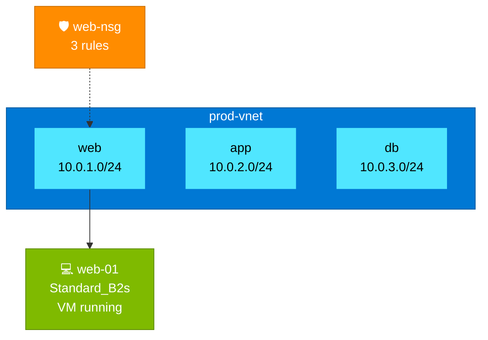

# @dougschaefer/azure

This extension gives [Swamp](https://swamp.club) native control over Azure infrastructure, covering the resource types that show up in real deployments (VNets with subnets and peering, NSGs with security rules, VMs with full lifecycle operations, vWAN with hub connections and VPN sites) rather than a simplified subset that only works for demos. Everything runs through the Azure CLI, so authentication delegates to whatever `az login` session exists on the machine and there is nothing proprietary between you and your subscription.

Beyond the standard CRUD operations, the extension includes topology visualization that generates Azure-branded Mermaid diagrams of your resource group's network architecture, cost estimation against the public Azure Retail Pricing API, and ARM template export for IaC documentation. All outputs persist as versioned data in Swamp.

## Installation

```bash
swamp extension pull @dougschaefer/azure
```

## Prerequisites

You need the [Swamp CLI](https://swamp.club), the [Azure CLI](https://learn.microsoft.com/cli/azure/install-azure-cli) installed and authenticated (`az login`), and an Azure subscription.

## Model Types

The extension provides 13 model types organized by Azure service category. Each model maps to a specific Azure resource type and exposes the operations you would otherwise run through `az` commands or the portal, tracked as versioned Swamp resources with full audit history.

### Networking

The networking models cover the full stack from VNets and subnets up through NSGs, route tables, public IPs, NAT gateways, Azure Firewall, and vWAN with its hub-and-spoke topology. The vWAN model alone has 18 methods because virtual WAN deployments involve WANs, hubs, hub connections, VPN sites, and VPN gateways as distinct but interdependent resources.

| Model | Type | Description |
|-------|------|-------------|
| VNet | `@dougschaefer/azure-vnet` | Virtual networks, subnets, and peering connections |
| NSG | `@dougschaefer/azure-nsg` | Network security groups and security rules |
| Route Table | `@dougschaefer/azure-route-table` | Route tables and user-defined routes (UDR) |
| Public IP | `@dougschaefer/azure-public-ip` | Public IP addresses (Standard/Basic, Static/Dynamic) |
| NAT Gateway | `@dougschaefer/azure-nat-gateway` | NAT gateways for outbound connectivity |
| Azure Firewall | `@dougschaefer/azure-firewall` | Azure Firewall instances and firewall policies |
| vWAN | `@dougschaefer/azure-vwan` | Virtual WANs, virtual hubs, hub connections, VPN sites, and VPN gateways |

### Compute

The VM model provides full lifecycle management, from creation and sizing through start, stop, deallocate, restart, resize, and arbitrary command execution via `runCommand`.

| Model | Type | Description |
|-------|------|-------------|
| VM | `@dougschaefer/azure-vm` | Virtual machines with full lifecycle management |

### Data

SQL logical servers and databases alongside storage accounts covering Blob, File, Table, and Queue services.

| Model | Type | Description |
|-------|------|-------------|
| Azure SQL | `@dougschaefer/azure-sql` | SQL logical servers and databases |
| Storage Account | `@dougschaefer/azure-storage-account` | Storage accounts (Blob, File, Table, Queue) |

### Security

Key Vault for secrets, keys, and certificate management, wired into Swamp's resource tracking so you have visibility into vault state alongside the resources that consume those secrets.

| Model | Type | Description |
|-------|------|-------------|
| Key Vault | `@dougschaefer/azure-key-vault` | Azure Key Vault for secrets, keys, and certificates |

### Management

Resource group operations and the topology model, which generates Mermaid diagrams, cost estimates, and ARM template exports for any resource group.

| Model | Type | Description |
|-------|------|-------------|
| Resource Group | `@dougschaefer/azure-resource-group` | Azure resource groups |
| Topology | `@dougschaefer/azure-topology` | Mermaid diagrams, cost estimates, ARM template export |

## Quick Start

### 1. Create a model instance

After pulling the extension, create a model instance for your subscription:

```bash
swamp model create
```

Select the model type (e.g., `@dougschaefer/azure-vm`) and provide your subscription ID in the global arguments.

### 2. Run methods

```bash
# List all VMs in a resource group
swamp model execute --method list

# Get a specific VM
swamp model execute --method get

# Start/stop/deallocate VMs
swamp model execute --method start
swamp model execute --method deallocate
```

### 3. Generate a topology diagram

Create a `@dougschaefer/azure-topology` model instance and run:

```bash
swamp model execute --method generate
```

This produces a Mermaid diagram of your resource group's network topology, covering VNets, subnets, VMs, NSGs, firewalls, NAT gateways, route tables, and public IPs with Azure-branded colors and relationship arrows. The diagram renders natively in GitHub markdown, VS Code, and most documentation tools.

### 4. Estimate costs

```bash
swamp model execute --method costEstimate
```

Queries the [Azure Retail Pricing API](https://learn.microsoft.com/rest/api/cost-management/retail-prices/azure-retail-prices) (public, no auth required) to estimate monthly costs for VMs and Azure Firewalls in a resource group.

### 5. Export ARM template

```bash
swamp model execute --method exportTemplate
```

Exports the full ARM template for a resource group, stored as versioned data in Swamp for IaC documentation and audit trail.

## Method Reference

### VM Methods (11)

`list` · `get` · `getInstanceView` · `create` · `delete` · `start` · `stop` · `deallocate` · `restart` · `resize` · `listSizes` · `runCommand`

### VNet Methods (10)

`list` · `get` · `create` · `delete` · `listSubnets` · `getSubnet` · `createSubnet` · `deleteSubnet` · `listPeerings` · `createPeering` · `deletePeering`

### NSG Methods (8)

`list` · `get` · `create` · `delete` · `listRules` · `getRule` · `createRule` · `updateRule` · `deleteRule`

### Route Table Methods (7)

`list` · `get` · `create` · `delete` · `listRoutes` · `createRoute` · `deleteRoute`

### Azure Firewall Methods (7)

`list` · `get` · `create` · `delete` · `listPolicies` · `getPolicy` · `createPolicy`

### vWAN Methods (18)

`listVwans` · `getVwan` · `createVwan` · `deleteVwan` · `listHubs` · `getHub` · `createHub` · `deleteHub` · `listHubConnections` · `createHubConnection` · `deleteHubConnection` · `listVpnSites` · `getVpnSite` · `createVpnSite` · `deleteVpnSite` · `listVpnGateways` · `getVpnGateway` · `inventory`

### Azure SQL Methods (7)

`listServers` · `getServer` · `createServer` · `deleteServer` · `listDatabases` · `createDatabase` · `deleteDatabase`

### Topology Methods (3)

`generate` · `costEstimate` · `exportTemplate`

### Simple CRUD Models (4 methods each)

Resource Group · Public IP · NAT Gateway · Storage Account · Key Vault

## Authentication

The extension delegates all authentication to the Azure CLI, which means it works with any method `az login` supports, from interactive browser login through service principal credentials, managed identity, and device code flow. There is no separate credential store or auth configuration in the extension itself.

For multi-subscription environments, each model instance can target a different subscription via the `subscriptionId` global argument. Credentials can be stored in Swamp vault:

```
${{ vault.get('azure', 'SUBSCRIPTION_ID') }}
```

## Topology Visualization

The `generate` method on `@dougschaefer/azure-topology` produces Mermaid diagrams that render the full network topology of a resource group with Azure-branded color coding for each resource type. The diagram includes VNets as subgraphs with address spaces, subnets with CIDR prefixes, VMs with size and power state, NSGs with rule counts connected to their associated subnets, route tables with route counts, Azure Firewalls connected to AzureFirewallSubnet, NAT gateways connected to their subnets, and public IPs associated to VMs and firewalls.

Example output renders as:



## License

MIT
